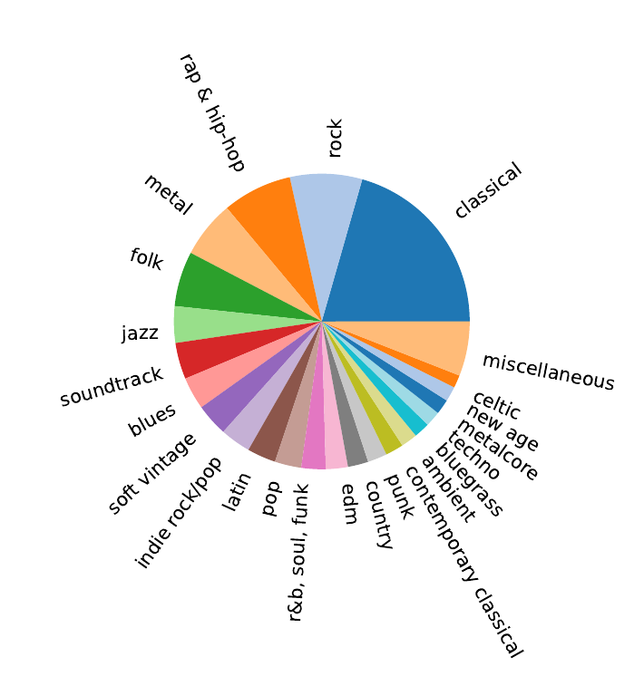

# Spotify feat. Logistic Regression - Popularity, Nothing Else Matters

> What is the musical taste of the world? With the recent rise and global pervasiveness of music streaming services, such as Spotify, or Apple Music, answering this question has potentially become tractable. For this, we analyze a subset of 1.2 million songs scraped from Spotify that we further augment with popularity and genre informations. While we find that the musical features extracted by Spotify are discriminative of the genre of a song, they are poor predictors of the populrity if used in a linear model, such as linear or logistic regression. Our results indicate that either more complex models are necessary or that the task itself is to some degree ill-posed, for instance due to a low signal-to-noise ratio.

### Data preparation

1. Download raw dataset from https://www.kaggle.com/rodolfofigueroa/spotify-12m-songs
2. Download artists informations: `python nem/download_artists.py`
3. Download song popularities: `python nem/download.py`
4. Filter songs and annotate genres: `python nem/cleanup.py`

### Running the experiments
* Agglomerative clustering: `python nem/cluster_genres.py`
* Logistic regression: `python nem/logistic_regression.py`
* t-SNE: `python nem/tsne_genres.py`

## Supplementary Material

#### Filtering procedure

To reduce potential noise introduced by unknown self-published artists, we want to restrict our analysis to those that can be considered professional or semi-professional musicians. This step was deemed necessary, as self-published artists do not undergo the feedback and quality control process a regular music label would provide. Indeed, we find that a quarter of artists on Spotify have less than 45 followers and half of all artist have less than 393.

We find that the number of followers is roughly exponentially distributed. After applying a logarithmic transform, a clear linear relationship between the number of log-followers and popularity is visible (Pearson correlation coefficient: 0.88). Compare figures [artists_unfiltered.pdf](figures/artists_unfiltered.pdf) and [artists_filtered.pdf](figures/artists_unfiltered.pdf).

Based on the popularity and log-follower count, we derive a robust filter criterion using principal component analysis (PCA). After applying PCA, the first principal component is treated as a measure of the successfulness of an artist, taking both his popularity and followers into account. We threshold this measure to only include 50% of all artists. Furthermore, we threshold the second component as well to remove outliers, i.e. artists with a high discrepancy between popularity and follower count. This step affects 1.6% of all artists. Finally, we exclude those without associated genres.

In total, 62.8% of all artists are removed from the dataset. This reduces the number of songs left in the dataset to 755472 (62.75%).

#### t-SNE 

[t-SNE figure](figures/tsne_genres.pdf)

#### Distribution of supergenres:

