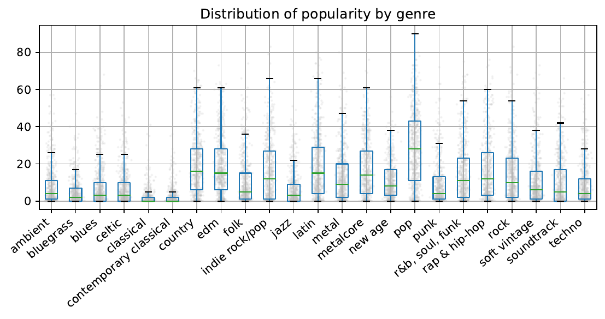

# SpotifyDataLiteracy2021

## Todo

- ~~For a subset of artists / songs, get a list of related items~~
- ~~Use these relations for clustering (maybe even manually with t-SNE)~~
- ~~Assign meta-genres to clusters~~
- Associate sub-genres to meta-genres (majority vote)
- ~~Target variable from pca & subsample dataset (remove unpopular ones)~~
- ~~Logistic Regression on Audio features to predict popularity~~

### Writing
- ~~1. Intro~~
- ~~2. Data Processing~~
- 3. TSNE
- ~~4. Logistic~~
- 5. Discussion

